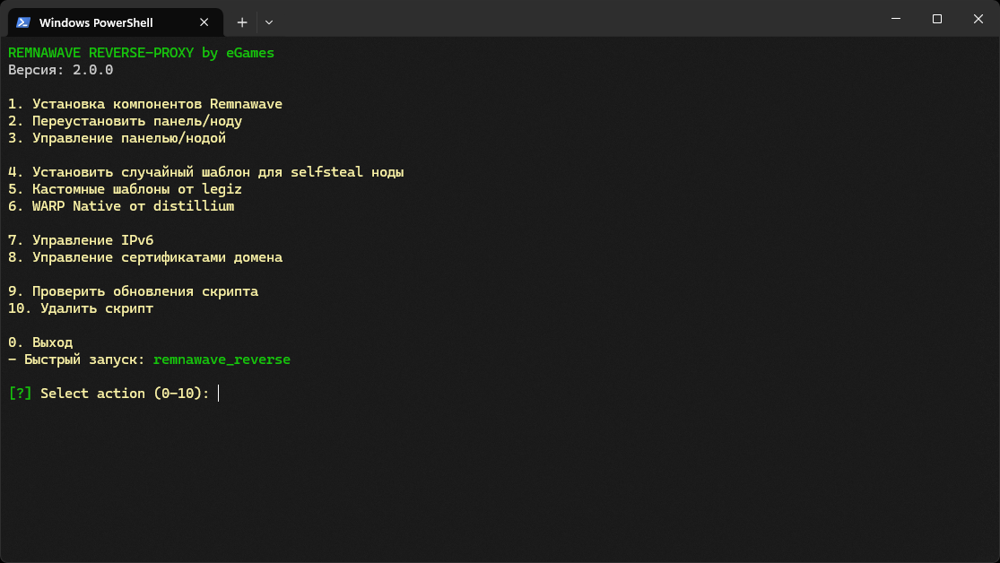

<p aling="center"><a href="https://github.com/eGamesAPI/remnawave-reverse-proxy">
 <picture>
   <source media="(prefers-color-scheme: dark)" srcset="./media/logo.png" />
   <source media="(prefers-color-scheme: light)" srcset="./media/logo-black.png" />
   
 </picture>
</a></p>

Русский | [English](/README.md)

> [!CAUTION]
> **ЭТОТ РЕПОЗИТОРИЙ - УЧЕБНЫЙ ПРИМЕР ДЛЯ ИЗУЧЕНИЯ NGINX, РЕВЕРС-ПРОКСИ И ОСНОВ СЕТЕВОЙ БЕЗОПАСНОСТИ. ЭТОТ СКРИПТ ДЕМОНСТРИРУЕТ НАСТРОЙКУ NGINX КАК REVERSE PROXY. НЕ ДЛЯ ПРОДА И НЕ ДЛЯ ПРОДАКШН-ИСПОЛЬЗОВАНИЯ! ЕСЛИ ВЫ НЕ ПОНИМАЕТЕ КАК РАБОТАЕТ ПАНЕЛЬ УПРАВЛЕНИЯ - ЭТО ВАШИ ПРОБЛЕМЫ, А НЕ АВТОРА СКРИПТА. ИСПОЛЬЗУЙТЕ НА СВОЙ СТРАХ И РИСК!**

### Сервер с использованием реверс-прокси NGINX
Данный скрипт разработан для упрощённой настройки обратного прокси-сервера с использованием NGINX и Xray, а также для автоматизированной установки панели управления и ноды Remnawave. В этой конфигурации Xray работает непосредственно на порту 443, перенаправляя трафик через сокет, который слушает NGINX. Такой подход минимизирует лишние затраты на TCP, обеспечивая более высокую производительность и надёжность соединения.
> [!IMPORTANT]
> Поддержка Debian и Ubuntu. Cкрипт был протестирован в среде виртуализации KVM. Для корректной работы вам потребуется собственный домен. Рекомендуется запускать с правами root на свежеустановленной системе.

Скрипт поддерживает установку как на одном сервере (панель и нода вместе), так и на двух отдельных серверах в зависимости от ваших потребностей:

- Единый сервер: Подходит для компактного развертывания, где панель управления и Xray нода устанавливаются на одной машине.
- Сервер для панели: Используется как центр управления, не содержит Xray ноду.
- Сервер для ноды: Размещает Xray ноду и заглушку Self Steal для VLESS REALITY.
Чтобы обеспечить корректную работу, вам нужно заранее подготовить три домена (или поддомена): первый будет использоваться для панели управления, второй — для обработки подписок, а третий — для сайта-заглушки Self Steal, размещённого на сервере с нодой.

-----

### Настройка домена
Скрипт поддерживает два способа настройки домена: через Cloudflare или с использованием ACME на вашем хостинг-провайдере.

### Настройка DNS-записей для варианта панель + нода на одном сервере

| Type  | Name              | Content          | Proxy status  |
| ----- | ----------------- | ---------------- | ------------- |
| A     | example.com       | your_server_ip   | DNS only      |
| CNAME | panel.example.com | example.com      | DNS only      |
| CNAME | sub.example.com   | example.com      | DNS only      |
| CNAME | node.example.com  | example.com      | DNS only      |

> [!TIP]
> Запись node.example.com - для selfsteal ноды не обязательна, Вы можете использовать и для selfsteal запись example.com

### Настройка DNS-записей для варианта панель и нода на разных серверах

| Type  | Name              | Content                 | Proxy status  |
| ----- | ----------------- | ----------------------- | ------------- |
| A     | example.com       | your_server_ip          | DNS only      |
| CNAME | panel.example.com | example.com             | DNS only      |
| CNAME | sub.example.com   | example.com             | DNS only      |
| A     | node.example.com  | your_server_ip_vps_node | DNS only      |

-----

### Рекомендации по установке
### 1. Для установки на одном сервере:
   - Выберите опцию "Установка компонентов Remnawave", а затем "Установить панель и ноду на один сервер". После завершения процесса скрипт автоматически перезапустит панель и предоставит все необходимые данные для входа в неё.
### 2. Для раздельной установки на двух серверах:
   - Начните с первого сервера и выберите опцию "Установка компонентов Remnawave", а затем "Установить только панель". Дождитесь, пока скрипт завершит настройку и выдаст данные для входа в панель.
   - Зайдите в панель управления, перейдите в раздел "Ноды" → "Управление", выберите нужную ноду и нажмите на кнопку "Важная информация". В появившемся окне вы увидите иконку для копирования сертификата — нажмите на неё.
   - Перейдите ко второму серверу и выберите опцию "Установка компонентов Remnawave", а затем "Установить только ноду". Когда скрипт запросит сертификат, вставьте ранее скопированный ключ.
   - После завершения настройки вы увидите сообщение о том, что нода успешно подключена.

-----

### Защита панели с помощью URL-параметра
Для повышения безопасности панели в конфигурации NGINX реализован дополнительный уровень защиты от её обнаружения:
- Чтобы получить доступ к панели, необходимо перейти по ссылке следующего формата:
  ```
  https://panel.example.com/auth/login?<SECRET_KEY>=<SECRET_KEY>
  ```
- При таком запросе параметр ?<SECRET_KEY>=<SECRET_KEY> автоматически устанавливает в браузере специальную Cookie с именем <SECRET_KEY> и значением <SECRET_KEY>.
- Если Cookie отсутствует или URL-запрос не содержит указанного параметра, пользователь увидит либо пустую страницу, либо ошибку 404 — в зависимости от запрашиваемого пути.

Благодаря этому механизму панель остаётся скрытой от посторонних. Даже если злоумышленник попытается сканировать хост или перебирать пути, без правильного параметра и соответствующей Cookie доступ к панели будет невозможен.

-----

### Включает в себя
1. Конфигурация прокси сервера:
   - Поддержка автоматического обновления конфигураций через подписку и JSON подписку с возможностью конвертации в форматы для популярных приложений.
2. Настройку обратного прокси NGINX в связке с Xray.
3. Обеспечение безопасности:
   - Настройка UFW для управления доступом.
   - SSL-сертификаты Cloudflare/ACME с автоматическим продлением.
   - Управление IPv6 для предотвращения потенциальных уязвимостей.
   - Оптимизация BBR для улучшения производительности TCP-соединений.
   - Выбор случайного шаблона веб-сайта из массива.

-----

### Настройка сервера:

Для настройки сервера запустите на нём эту команду:

Для последней версии Remnawave
```
bash <(curl -Ls https://raw.githubusercontent.com/eGamesAPI/remnawave-reverse-proxy/refs/heads/main/install_remnawave.sh)
```

Для версии 1.7.5 (совместима с панелью 1.6.16):
```
bash <(curl -Ls https://raw.githubusercontent.com/eGamesAPI/remnawave-reverse-proxy/refs/tags/v.1.7.5/install_remnawave.sh)
```
<p align="center"><a href="#"></a></p>

-----

> [!IMPORTANT]
> **Этот репозиторий предназначен исключительно для образовательных целей и для изучения принципов работы обратных прокси-серверов и сетевой безопасности. Скрипт демонстрирует настройку прокси-сервера с использованием NGINX для реверс-прокси, управления трафиком и защиты от атак.**
>
> **Мы настоятельно напоминаем, что использование этого инструмента с целью обхода сетевых блокировок или цензуры является незаконным в ряде стран, где существуют законы, регулирующие использование технологий для обхода ограничений в интернете.**
>
> **Данный проект не предназначен для использования в целях, нарушающих законы о защите информации или вмешивающихся в механизмы цензуры. Мы не несем ответственности за возможные юридические последствия, связанные с использованием этого скрипта.**
>
> **Используйте этот инструмент/скрипт исключительно в демонстрационных целях, в качестве примера работы обратного прокси и защиты данных. Настоятельно рекомендуем удалить скрипт после ознакомления. Дальнейшее использование на ваш страх и риск.**
>
> **Если вы не уверены, нарушает ли использование данного инструмента или его компонентов законодательство вашей страны- откажитесь от любого взаимодействия с данным инструментом.**

## Чат в Telegram

Присоединяйтесь к нашему [чату в Telegram](https://t.me/remnawave_reverse), чтобы задавать вопросы и обсуждать проект с другими пользователями.

## Пожертвования

Если вам нравится этот проект и вы хотите поддержать его дальнейшее развитие, пожалуйста, рассмотрите возможность сделать пожертвование. Ваш вклад помогает финансировать будущие обновления и улучшения!

**Способы пожертвования:**

- **TON USDT:** `UQAxyZDwKUPQ5Bp09JOFcaDVakjYQT46rf3iP3lnl_qc9xVS`
