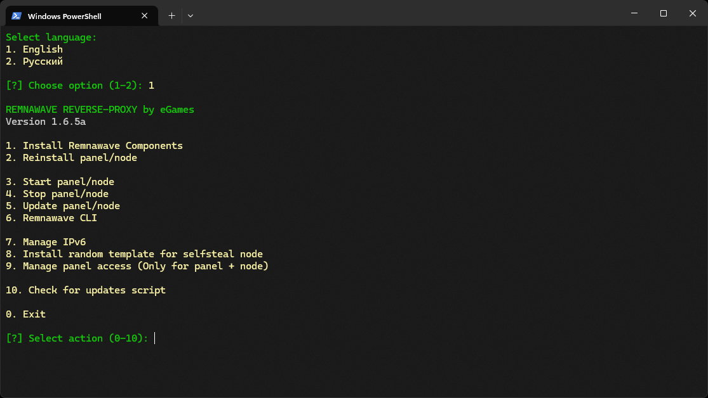

# REMNAWAVE-REVERSE-PROXY ([Russian](/README-RU.md))
### Server Using NGINX Reverse Proxy
This script is designed to streamline the setup of a reverse proxy server using NGINX and Xray, as well as to automate the installation of the Remnawave control panel and node. In this configuration, Xray operates directly on port 443, forwarding traffic through a socket that NGINX listens to. This approach minimizes unnecessary TCP overhead, delivering improved performance and connection reliability.
> [!IMPORTANT]
> This script has been tested in a KVM virtualization environment. For proper operation, you will need your own domain, which must be linked to Cloudflare. It is recommended to run the script with root privileges on a freshly installed system.

The script supports deployment on either a single server (with both the panel and node together) or two separate servers, depending on your needs:

- Single Server: Ideal for a compact setup where the control panel and Xray node are installed on the same machine.
- Panel Server: Serves as the central management hub, without hosting an Xray node.
- Node Server: Hosts the Xray node along with a Self Steal stub for VLESS REALITY.
To ensure proper operation, you need to prepare three domains (or subdomains) in advance: the first will be used for the control panel, the second for handling subscriptions, and the third for the Self Steal stub site, which is hosted on the node server.
-----
### Cloudflare Configuration
1. Configure Cloudflare:
   - Link your domain to Cloudflare.
   - Add the following DNS records:

| Type  | Name              | Content          | Proxy status  |
| ----- | ----------------- | ---------------- | ------------- |
| A     | example.com       | your_server_ip   | DNS only      |
| CNAME | panel.example.com | example.com      | DNS only      |
| CNAME | sub.example.com   | example.com      | DNS only      |

2. SSL/TLS settings in Cloudflare:
   - Go to SSL/TLS > Overview and select Full for the Configure parameter.
   - Set Minimum TLS Version to TLS 1.3.
   - Enable TLS 1.3 (true) in the Edge Certificates section.
-----
### Installation Guidelines
### 1. Single Server Setup:
   - Select the option to install both the panel and node on the same machine. Once the process is complete, the script will automatically restart the panel and provide all necessary login credentials.
### 2. Dual Server Setup
   - Start by installing the panel on the first server. Wait for the script to finish the setup and provide the login credentials for the panel.
   - Log into the control panel, navigate to Nodes → Management, select the desired node, and click the Important button. In the pop-up window, you’ll see an icon to copy the certificate — copy it.
   - Proceed to the second server and initiate the node installation. When prompted, paste the certificate you copied earlier.
   - Upon completion, you’ll see a message confirming that the node has been successfully connected.
-----
### Panel Protection via URL Parameter
To enhance the security of the panel, an additional layer of protection against detection has been implemented in the NGINX configuration:
- To access the panel, you must navigate to a URL in the following format:
  ```
  https://panel.example.com/auth/login?<SECRET_KEY>=<SECRET_KEY>
  ```
- This request automatically sets a special Cookie in the browser with the name <SECRET_KEY> and the value <SECRET_KEY>.
- If the Cookie is missing or the URL request lacks the specified parameter, the user will encounter either a blank page or a 404 error, depending on the requested path.

This mechanism ensures the panel remains hidden from unauthorized access. Even if an attacker attempts to scan the host or brute-force paths, they will be unable to access the panel without the correct parameter and corresponding Cookie.

-----
### Proxy server configuration:
1. Proxy server configuration:
   - Support for automatic configuration updates via subscription and JSON subscription with the ability to convert to formats for popular applications.
2. NGINX reverse proxy setup in combination with Xray.
3. Security measures:
   - Configuration of Cloudflare SSL certificates with automatic renewal to secure connections.
   - UFW (Uncomplicated Firewall) setup for access management.
   - Disabling IPv6 to prevent potential vulnerabilities.
   - Selecting a random website template from an array.
4. Enabling BBR — improving TCP connection performance.
-----
### Server Setup:

To set up the server, run this command on it:

```
bash <(curl -Ls https://raw.githubusercontent.com/eGamesAPI/remnawave-reverse-proxy/refs/heads/dev/install_remnawave.sh)
```
<p align="center"><a href="#"></a></p>
